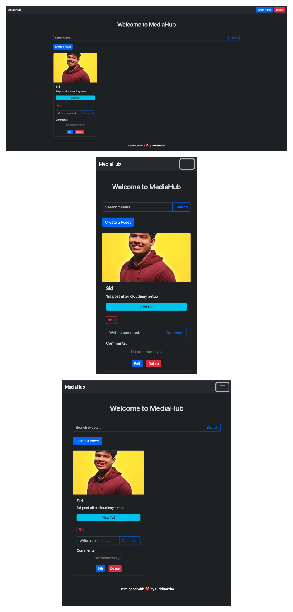

# MediaHub

MediaHub is a dynamic social media platform that allows users to create, view, and interact with tweets in an engaging way. The platform is built using Django for the backend and HTML, CSS, and Bootstrap for the frontend. This repository contains the source code for the MediaHub project.

---

## Features

- Create and edit tweets with images.
- View, like, and comment on tweets in real-time.
- Responsive design optimized for desktop, tablet, and mobile screens.

---

## Screenshots

Here are representations of MediaHub across various devices:



---

## Setup Instructions

Follow these steps to set up MediaHub locally:

### Prerequisites

1. Install Python (3.8 or above).
2. Install pip and virtualenv.

### Steps

1. Clone the repository:

   ```bash
   git clone https://github.com/siddharthapal8240/MediaHub.git
   cd MediaHub
   ```

2. Create and activate a virtual environment:

   ```bash
   python -m venv venv
   source venv/bin/activate   # On Windows use `venv\Scripts\activate`
   ```

3. Install the dependencies:

   ```bash
   pip install -r requirements.txt
   ```

4. Create a `.env` file in the root directory and configure the following environment variables:

   ```env
   ALLOWED_HOSTS=
   API_KEY=
   API_SECRET=
   CLOUD_NAME=
   CLOUDINARY_URL=
   DATABASE_URL=
   DEBUG=
   SECRET_KEY=
   ```

5. Run database migrations:

   ```bash
   python manage.py migrate
   ```

6. Start the development server:

   ```bash
   python manage.py runserver
   ```

7. Access MediaHub at `http://127.0.0.1:8000`.

---

## Contributing

Contributions are welcome! Please fork this repository and submit a pull request.

---

## Contact

For any queries or suggestions, feel free to contact:

- **GitHub:** [siddharthapal8240](https://github.com/siddharthapal8240)
- **Email:** siddhartha.pal.official@gmail.com

---

## License

This project is licensed under the MIT License.
